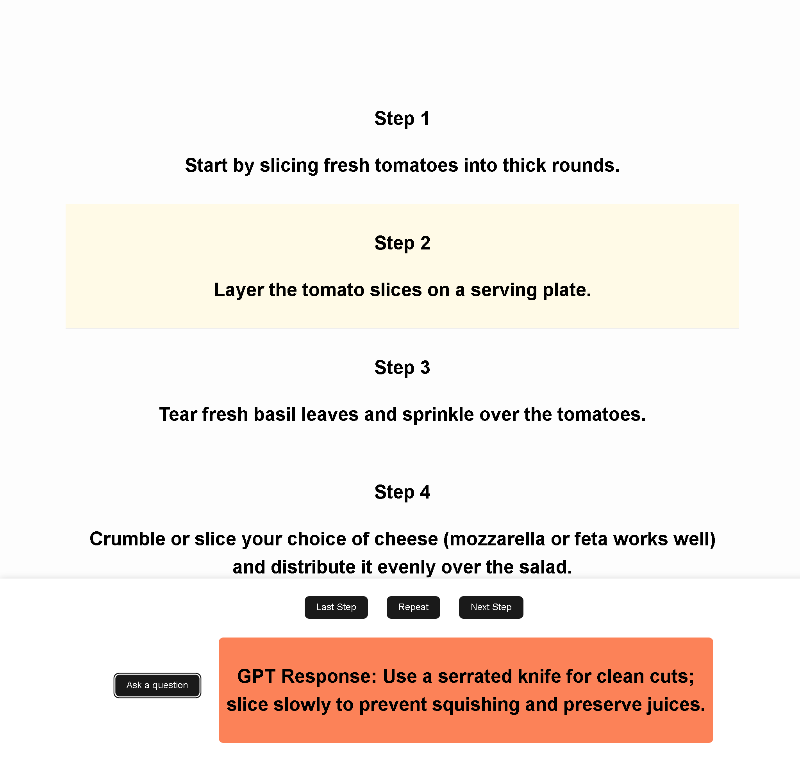

# RecipeAI - Your Personal Cooking Assistant

RecipeAI — your AI-powered sous-chef that guides you step-by-step through recipes, reads instructions out loud, and even answers your cooking questions—hands-free

🚀 Why RecipeAI?

- Step-by-step guidance with voice assistance 🔊
- Instant answers to any cooking question ❓
- Hands-free experience so you can focus on cooking 🍳

Good food, made easy.

# RecipeAI in Action




## Usage

```bash
$ npm install # or pnpm install or yarn install
$ npm run dev # run code locally
```

## Tools/Languages Used
- Typescript
- SolidJS
- TTS
- Speech to text
- ChatGPT API